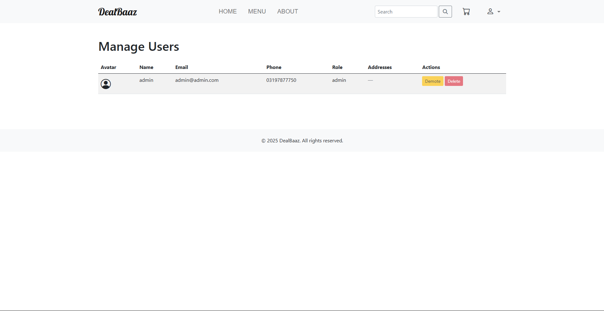
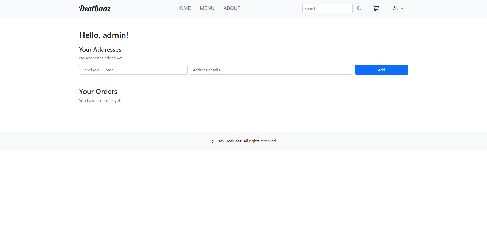
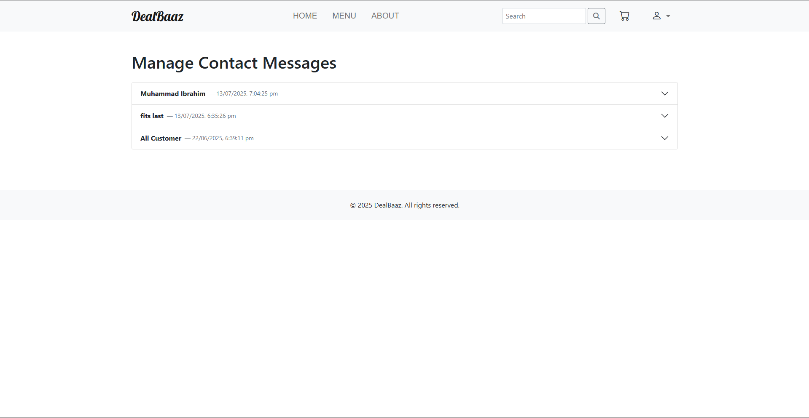

# E-Commerce Store – Node.js, Express, and EJS Project

Welcome to the E-Commerce Store, a modern web application for managing products, orders, users, and contacts. This project is built with Node.js, Express, MongoDB, and EJS, providing a robust platform for both administrators and customers to manage online shopping efficiently.

## ✨ Project Overview
This system allows admins to manage products, orders, and users, while customers can browse, shop, and manage their profiles. The project features a clean UI, role-based access, and a modern tech stack.

---

## 📸 Screenshots

<div align="center">







</div>

---

## 🚀 Getting Started

**No coding experience needed!**

### Prerequisites
- [Git](https://git-scm.com/downloads)
- [Node.js](https://nodejs.org/)
- [MongoDB](https://www.mongodb.com/try/download/community)

---

### Installation

#### **A) Using VS Code**
1. Open VS Code and open a new empty folder.
2. Open the terminal:
   - Shortcut: <kbd>Ctrl</kbd> + <kbd>`</kbd> (backtick)
   - Or: Menu → View → Terminal
3. Copy and paste the command below and press Enter.

#### **OR**

#### **B) Using PowerShell (Windows)**
1. Open PowerShell (press <kbd>Win</kbd> + <kbd>R</kbd>, type `powershell`, press Enter)
2. Navigate to the folder where you want the project (e.g., `cd Desktop`)
3. Copy and paste the command below and press Enter.

---

```powershell
if (-not (Get-Command git -ErrorAction SilentlyContinue)) {
  Write-Host "\n\n\n\n\n==============================" -ForegroundColor Red
  Write-Host "Git is not installed!" -ForegroundColor Red
  Write-Host "Please install Git from: https://git-scm.com/downloads" -ForegroundColor Red
  Write-Host "==============================\n\n\n\n\n" -ForegroundColor Red
  exit
}
git clone https://github.com/Muhammad-Umar786/ecom-store.git
cd ecom-store
node scripts/initialize.js
```

**What this does:**
- Checks if you have Git, Node.js, and MongoDB installed (shows download links if missing)
- Downloads all project files
- Sets up everything automatically: environment, dependencies, database, demo data
- Shows demo login info
- Starts the server and opens the app in your browser

That’s it! You’re ready to use the E-Commerce Store.

---

## 👤 Demo Accounts

- **Admin**
  - Email: `admin@admin.com`
  - Password: `admin123`
- **User**
  - Email: `user@example.com`
  - Password: `user123`

---

## 🛠 Features
- Admin dashboard for managing products, orders, and users
- User registration, login, and profile management
- Product browsing, shopping cart, and order placement
- Role-based access control
- Clean, responsive UI

---

## 📝 Contributing
- Found a bug or have a suggestion? Please open an issue in the [Issues](../../issues) tab.
- Want to contribute? Fork the repo and submit a pull request!

---

## 📢 Project Description
This E-Commerce Store is a full-featured, open-source web application designed for modern online shopping. Built with Node.js, Express, MongoDB, and EJS, it offers a seamless experience for both administrators and customers. Whether you are looking to manage products, handle orders, or streamline user management, this project provides a scalable and customizable solution. Perfect for learning, teaching, or deploying in real-world scenarios.

Feel free to contact me for a professional version of this project or for any custom development needs. I can help you build a tailored solution that meets your specific requirements.

---

## 🙏 Conclusion
Thank you for checking out this E-Commerce Store! We welcome your feedback, suggestions, and contributions. Feel free to star the repo, report issues, or fork and enhance the project. Happy shopping!
